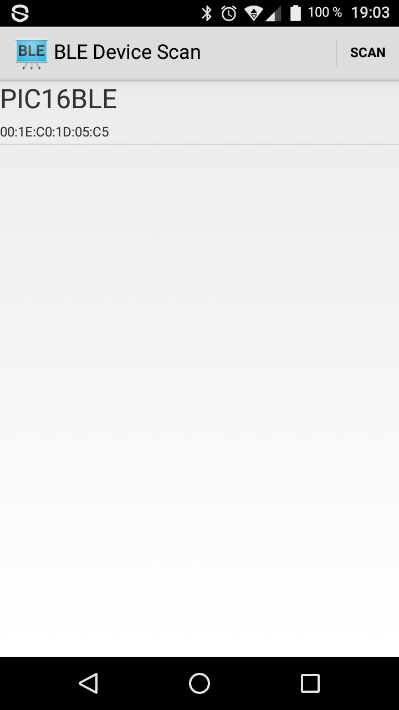
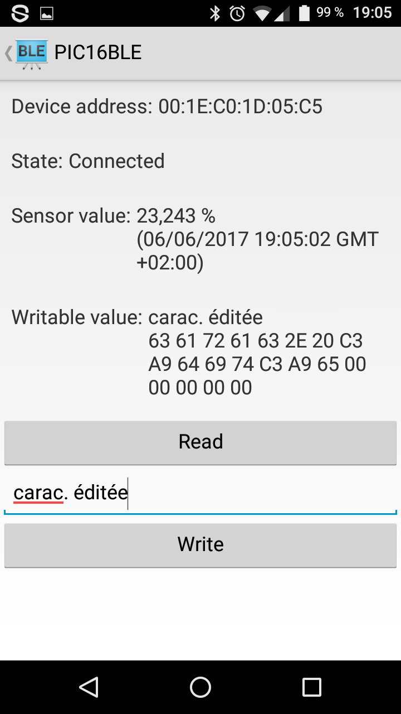

Client BLE
==========

**Code from [https://github.com/googlesamples/android-BluetoothLeGatt](https://github.com/googlesamples/android-BluetoothLeGatt)
modified by Lucile Mitermite and Louis-Guillaume Dubois, working for CentraleSupélec.**

Introduction
------------

This software shows a list of available Bluetooth LE devices which run our private GATT service (see our main report)
and provides an interface to connect, display and write the characteristics of this private GATT service.

It creates a [Service][1] for managing connection and data communication with the GATT server
hosted on a given Bluetooth LE device.

The Activities communicate with the Service, which in turn interacts with the [Bluetooth LE API][2].

[1]:http://developer.android.com/reference/android/app/Service.html
[2]:https://developer.android.com/reference/android/bluetooth/BluetoothGatt.html

Pre-requisites
--------------

- Android SDK 25
- Android Build Tools v25.0.2
- Android Support Repository

Screenshots
-------------

  

Getting Started
---------------

This app uses the Gradle build system. To build this project, use the
"gradlew build" command or use "Import Project" in Android Studio.

License
-------

Copyright 2016 The Android Open Source Project, Inc.

Copyright 2017 CentraleSupélec

Licensed to the Apache Software Foundation (ASF) under one or more contributor
license agreements.  See the NOTICE file distributed with this work for
additional information regarding copyright ownership.  The ASF licenses this
file to you under the Apache License, Version 2.0 (the "License"); you may not
use this file except in compliance with the License.  You may obtain a copy of
the License at

http://www.apache.org/licenses/LICENSE-2.0

Unless required by applicable law or agreed to in writing, software
distributed under the License is distributed on an "AS IS" BASIS, WITHOUT
WARRANTIES OR CONDITIONS OF ANY KIND, either express or implied.  See the
License for the specific language governing permissions and limitations under
the License.
